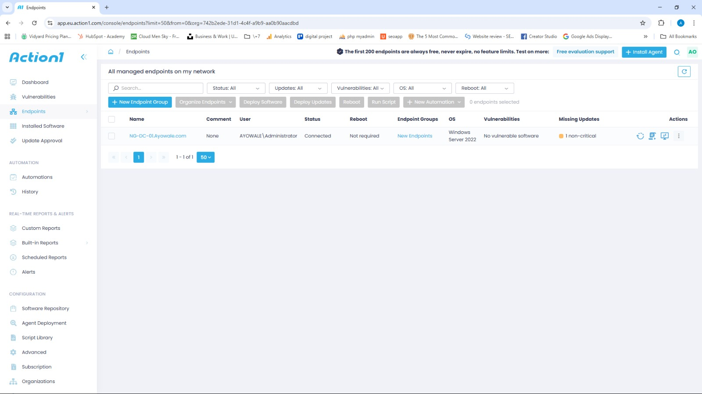

# Patch Management with Action1

This covers basic patch management and vulnerability remediation using Action1, a cloud-based endpoint management platform.

## Actions Performed

- Installed Action1 agent on Windows Server 2022
- Enrolled server into Action1 dashboard
- Reviewed available patches and vulnerabilities
- Observed automated patch management workflows

## Evidence

