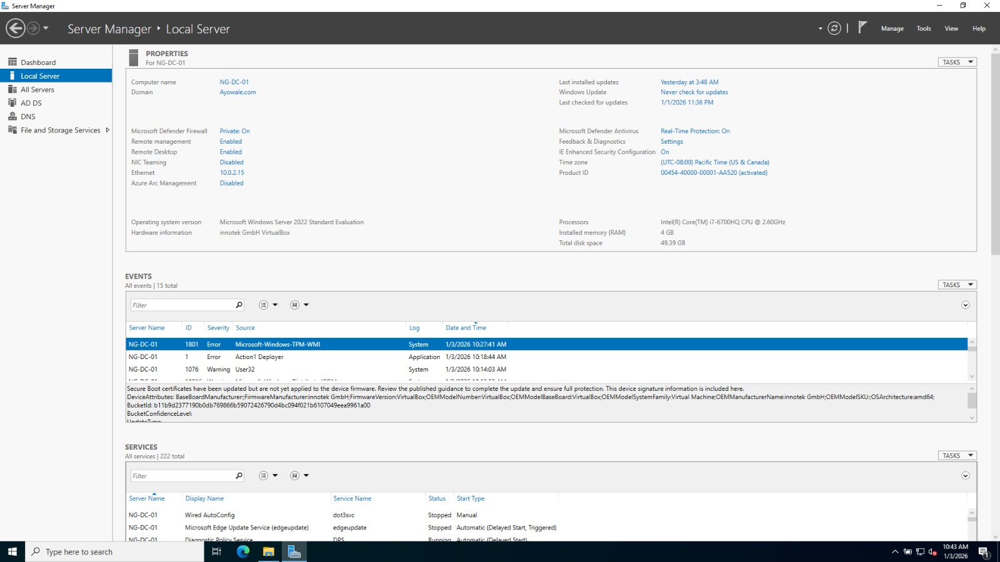

# Windows Server 2022 – Active Directory Setup

This documents the installation and configuration of Active Directory Domain Services (AD DS) on Windows Server 2022.

## Server Role

- Acts as the Domain Controller (DC)
- Manages authentication, authorization, and user accounts
- Centralized identity management for domain users

## Configuration Details

- Domain Name: Ayowale.com
- Network: NAT Network (Null)
- DNS: This was installed automatically with AD DS

## Installation Steps

1. Installed Windows Server 2022 iso from official windows sit then added to VirtualBox
2. Configured network adapter to use NAT Network (Null)
3. Opened **Server Manager**
4. Added the **Active Directory Domain Services** role
5. Promoted the server to a Domain Controller
6. Created a new forest with domain name `Ayowale.com`
7. Restarted server to complete configuration

## Evidence

