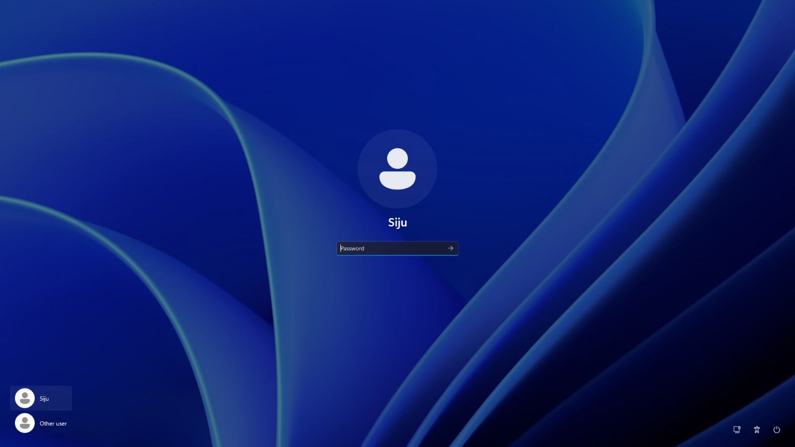
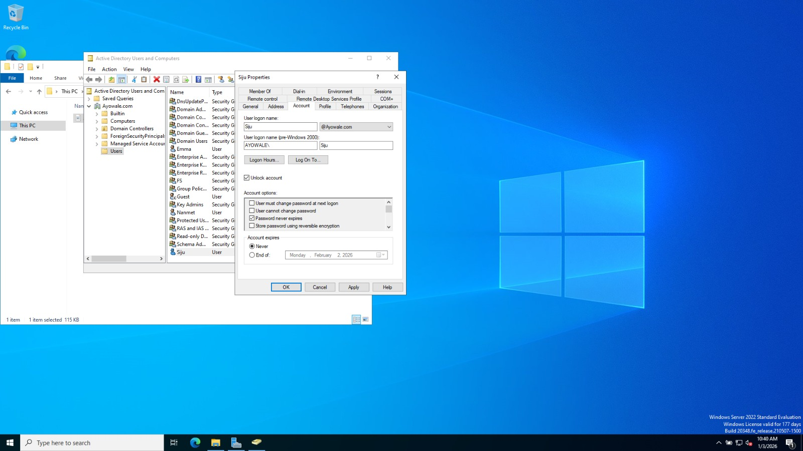

# Account Lockout Troubleshooting

## Scenario

User accounts were intentionally locked to simulate common Help Desk incidents such as repeated failed login attempts.

## Actions Taken

1. Locked a user account in Active Directory
2. Attempted login from Windows 11 client
3. Identified the locked account in ADUC
4. Unlocked the user account
5. Verified successful login after unlock

## Skills Demonstrated

- User issue identification
- Account recovery
- Active Directory troubleshooting
- Real-world Help Desk workflow simulation

## Evidence

### Locked Account

### Unlocked Account

