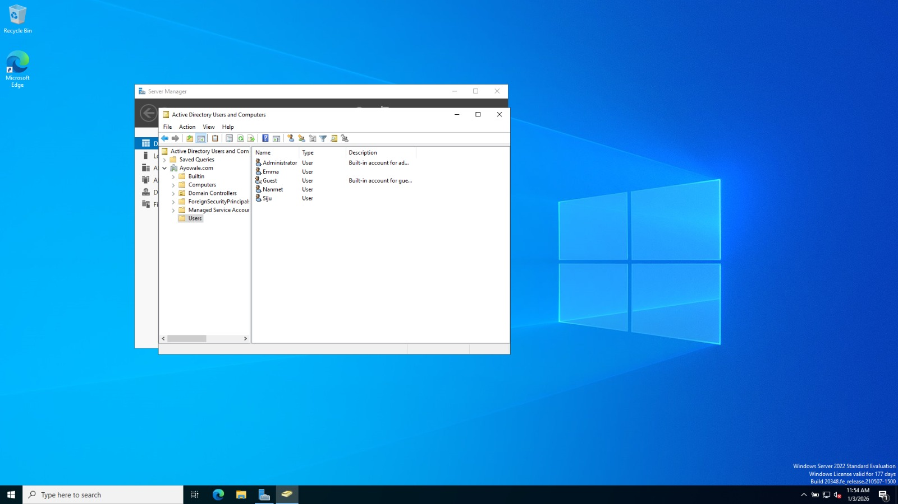

# Active Directory User Management

## Purpose

This section documents basic user account management tasks commonly handled by Help Desk personnel.

## Users Created

The following domain users were created in Active Directory:

- Siju
- Nanmet
- Emma

Users were created directly in the default container to focus on account fundamentals rather than organizational structure.

## Tasks Performed

- Created new domain user accounts
- Set initial passwords
- Enabled and disabled user accounts
- Verified login functionality on Windows 11

## Tools Used

- Active Directory Users and Computers (ADUC)

## Evidence

